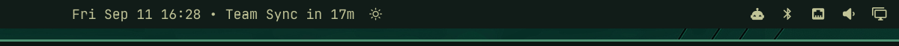

# Clock with Countdown Badge (`fred.clock`)

Fred's Omarchy clock and calendar plugin, a shell bar widget featuring upcoming event countdowns, multi-calendar support, and seamless in-place replacement of the stock Omarchy clock.



---

## Overview

`fred.clock` replaces the default `omarchy.clock` widget in Omarchy's status bar, preserving all existing settings while adding upcoming event countdown badges and a rich read-only interactive agenda:

| Feature | Description |
| :--- | :--- |
| **In-Place Replacement** | Replaces `omarchy.clock` in-place using Omarchy's `clonedFrom` routing. Stock date/time formats and cycle rings carry over automatically. |
| **Countdown Badge** | Displays upcoming events starting within 60 minutes directly on the bar (`HH:mm • Team Sync in 12m` or `Team Sync now`). |
| **Multi-Calendar Sync** | Fetches read-only schedules from Google Calendar or any iCalendar (`.ics`) secret URLs and local files with zero external dependencies. |
| **Interactive Agenda** | Selected day agenda list under the month grid with event times, color strips, meeting join buttons, and empty-state handling. |
| **Event Dots on Grid** | Up to 4 colored indicator dots on days with scheduled events matching calendar feed colors. |
| **Account Filter Chips** | Quick multi-account filtering (e.g. `All`, `Work`, `Personal`, `Projects`) directly in the agenda. |
| **1-Click Meeting Join** | Automatically detects Google Meet, Zoom, Teams, and Webex links with safe, non-blocking `xdg-open` launches. |
| **Markdown Copy** | Copy the selected day's complete agenda as structured Markdown (`y` hotkey or toolbar button). |

---

## Features

- **Next-Event Countdown**: When an event is within 60 minutes (configurable via `badgeMinutes`), the bar widget displays the event title and time remaining.
- **Rich Interactive Agenda**: Selecting any day in the month grid reveals its scheduled agenda cards, times, accounts, and meeting links.
- **Privacy-First & Read-Only**: Consumes private `.ics` subscription URLs via standard HTTP GET. No OAuth tokens, no write permissions, no risk of accidental modifications or unwanted invite dispatches.
- **Zero Daemon Dependencies**: Uses Python 3 standard library only (`ThreadPoolExecutor`, `urllib`, `zoneinfo`) for background fetching without extra background daemons.
- **Robust Recurrence & Timezones**: Supports standard RFC 5545 recurrence rules (`RRULE`), exclusions (`EXDATE`), all-day events, and wall-clock time preservation across daylight saving transitions (DST).
- **Non-Blocking Quickshell Integration**: Events are cached atomically at `~/.cache/fred.clock/events.json` (mode 0600) and watched reactively by Quickshell.

---

## Installation

Install using Omarchy's plugin manager:

```bash
omarchy plugin add https://github.com/greenermoose/omarchy-fred-clock.git --enable --yes
```

### Bar Center Anchor

Because Omarchy's bar center anchor is not automatically rewritten by plugin enabling, set `centerAnchor` in `~/.config/omarchy/shell.json`:

```bash
sed -i 's/"centerAnchor": "omarchy.clock"/"centerAnchor": "fred.clock"/' ~/.config/omarchy/shell.json
```

---

## Configuration

### Calendar Feeds

Configure your calendars in `~/.config/fred.clock/calendars.json` (permissions `0600`):

```json
[
  {
    "account": "Personal",
    "name": "Personal Calendar",
    "url": "https://calendar.google.com/calendar/ical/your-address%40gmail.com/private-xxxx/basic.ics",
    "color": "#4285f4",
    "enabled": true
  },
  {
    "account": "Family",
    "name": "Family Events",
    "url": "https://calendar.google.com/calendar/ical/your-group%40group.calendar.google.com/private-yyyy/basic.ics",
    "color": "#34a853",
    "enabled": true
  },
  {
    "account": "Local",
    "name": "Local Events",
    "path": "~/Documents/calendar.ics",
    "color": "#fbbc05",
    "enabled": false
  }
]
```

#### Finding Your Google Calendar Secret URL

1. In [Google Calendar](https://calendar.google.com), click the **⚙️ Settings** icon in the upper right.
2. In the left sidebar under **Settings for my calendars**, click the calendar you wish to sync.
3. Scroll down to the **Integrate calendar** section.
4. Copy the **"Secret address in iCal format"** URL (*not* the public address).
5. Paste the copied URL into the `"url"` field of your `calendars.json`.

#### Feed Properties

| Property | Type | Description |
| :--- | :--- | :--- |
| `account` | string | Category label shown on event cards and used for agenda filter chips (e.g. `Personal`, `Work`). |
| `name` | string | Descriptive calendar name (e.g. `Primary`, `Family`). |
| `url` | string | Secret `.ics` HTTP/HTTPS subscription URL. |
| `path` | string | Absolute or home-relative path to a local `.ics` file (alternative to `url`). |
| `color` | string | Hex color code (e.g. `"#4285f4"`) for grid dots and event card strips. |
| `enabled` | boolean | Set to `false` to temporarily skip fetching this feed without removing it. |

### Automatic Synchronization

Events are pulled and cached automatically in the background—**no terminal commands or daemon setups are required**:

- **Instant on Save**: The bar widget watches `~/.config/fred.clock/calendars.json`. The moment you save changes to your feeds, an immediate background fetch is triggered.
- **Periodic Background Sync**: Automatically checks and refreshes all enabled feeds every 15 minutes.
- **On Panel Open**: Opening the calendar panel checks cache freshness and refreshes events if older than 5 minutes.
- **Shell Startup**: Fetches automatically whenever your desktop session initializes.
- **Manual (Optional)**: If you ever want to force a refresh from the terminal: `python3 ~/.config/omarchy/plugins/fred.clock/fetch-events.py`


### Bar Settings

Inline widget settings in `~/.config/omarchy/shell.json`:

- `format`: Clock date/time format string (default: `"ddd MMM d HH:mm"`).
- `formatAlt`: Alternative date/time format string (default: `"d MMMM 'W'ww yyyy"`).
- `verticalFormat`: Format string when the bar is vertical (default: `"HH\n—\nmm"`).
- `badgeMinutes`: Maximum minutes ahead to show upcoming event countdown badges (default: `60`, set to `0` to disable).

---

## Interactions & Shortcuts

### Bar
- **Left Click**: Open / close the calendar and agenda panel.
- **Right Click**: Cycle through configured date and time formats.
- **Middle Click**: Open the Omarchy timezone switcher (`omarchy-menu-timezone`).

### Agenda Panel
- **Click Day Cell**: Select that date and display its agenda.
- **`y` / `Y`** (or copy button): Copy the selected day's agenda as Markdown to clipboard.
- **`t` / `T`** (or hero date click): Return to today.
- **`[` / `]`** (or chevrons / mouse wheel): Previous / next month.
- **`{` / `}`**: Previous / next year.
- **`w` / `W`** (or "W" heading click): Toggle week start day (Sunday vs. Monday).
- **Escape**: Close the panel.

---

## Uninstallation

To remove `fred.clock` and restore the default stock clock:

```bash
sed -i 's/"centerAnchor": "fred.clock"/"centerAnchor": "omarchy.clock"/' ~/.config/omarchy/shell.json
omarchy plugin remove fred.clock
```

## Acknowledgments

Developed with the assistance of [Antigravity](https://antigravity.google) (Google DeepMind), which contributed to the multi-calendar sync architecture, upcoming event countdown badge, and interactive agenda panel.

---

## License

GNU General Public License v3.0 or later. See [LICENSE](LICENSE) for details.
Upstream Omarchy MIT copyright and diff recipe documented in [UPSTREAM.md](UPSTREAM.md).
